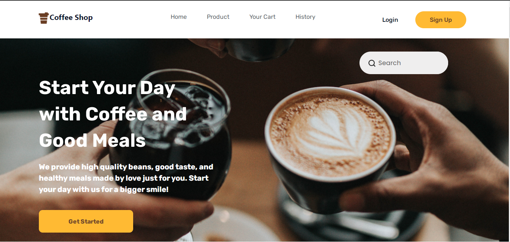
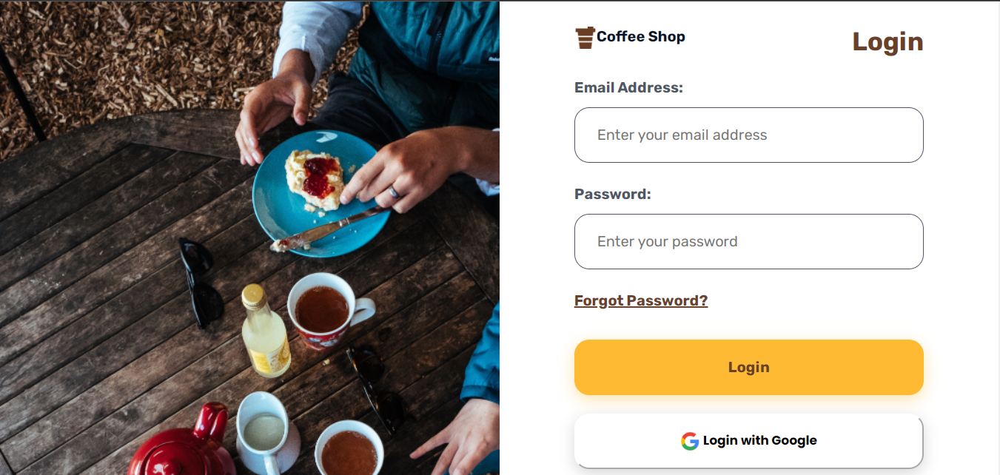
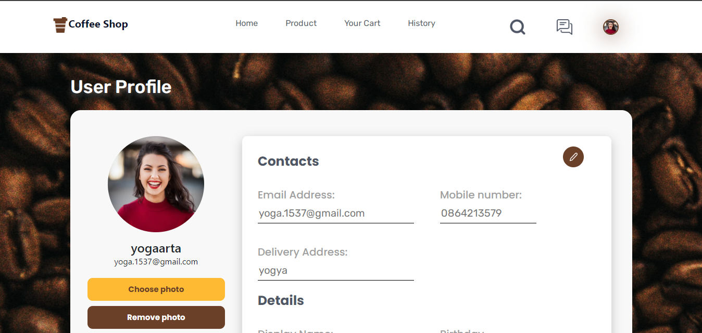
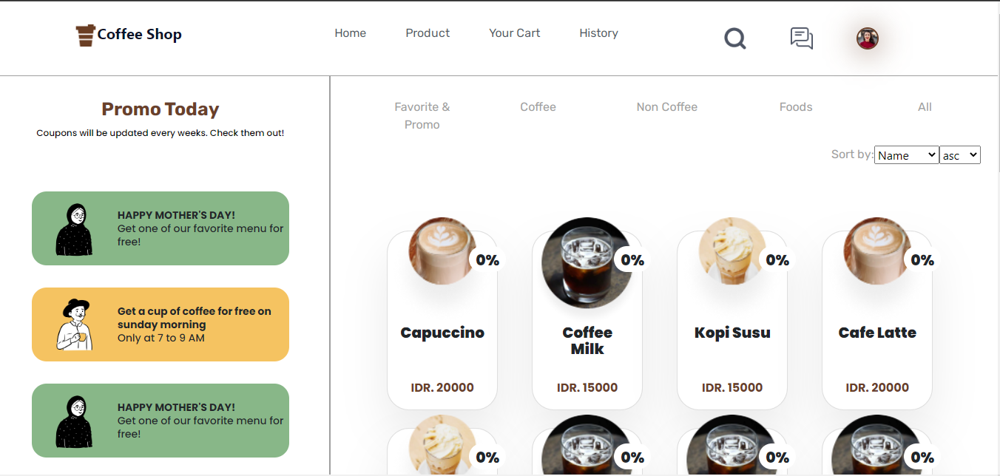

<div style="display: flex;
    justify-content: center;
    align-items: center;">

# GARGYO COFFEE SHOP

</div>
<div style="display: flex;
    justify-content: center;
    align-items: center;">


</div>

## BUILT WITH


<br>


## HOW TO USE
1. Clone this 2 repository.
    ```
    $ git clone https://github.com/yogaarta/gargyo-coffee-react.git

    $ git clone https://github.com/yogaarta/gargyo_coffee.git
    ```

2. Open VS Code or you can download and install it [here](https://code.visualstudio.com/).

3. Open menu **Terminal > New Terminal** or press **ctrl+shift+`** 

4. On terminal, change directory to **gargyo-coffee-react** then run 
    ```
    npm start
    ```

5. Open another terminal, change directory to **gargyo-coffee** then run
    ```
    npm run startDev
    ```

6. Enjoy the app!

## PREVIEW
<div style="display:flex, flex-direction: column" >






</div>

## BACKEND
[gargyo-coffee-backend](https://github.com/yogaarta/gargyo_coffee.git)