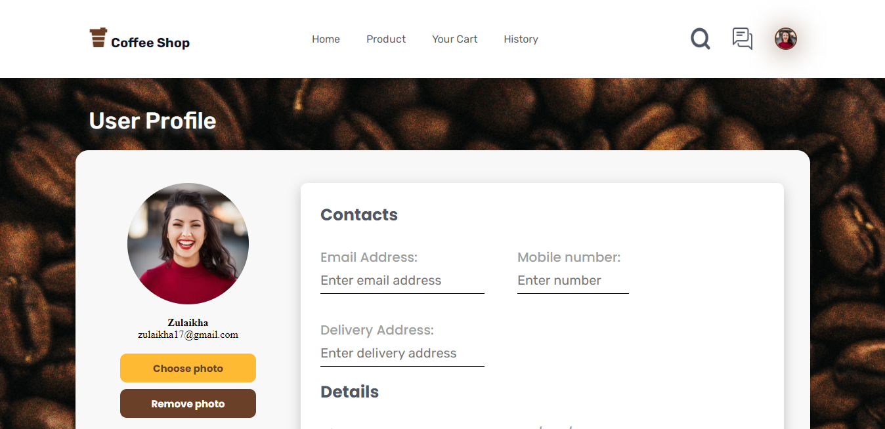

# GARGYO COFFEE SHOP


## BUILT WITH


<br>


## HOW TO INSTALL
1. Clone this 2 repository.
    ```
    $ git clone https://github.com/yogaarta/gargyo-coffee-react.git

    $ git clone https://github.com/yogaarta/gargyo_coffee.git
    ```

2. Open VS Code or you can download and install it [here](https://code.visualstudio.com/).

3. Open menu **Terminal > New Terminal** or press **ctrl+shift+`** 

4. 

## PREVIEW
<div style="display:flex, flex-direction: column" >



</div>

## RELATED PROJECT
[gargyo-coffee-backend](https://github.com/yogaarta/gargyo_coffee.git)